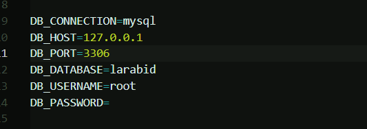

# Laravel Solution ``Lara Bid``

## 1 Import DataBase
Create data base an import file you will find it under folder ``Documentation`` file ``larabis.sql``

## 2 Configure file env
You will find the '.env' under the root path of the project

## 3 Create missing Folder 

You need to create folder  ``framework`` if no existe under ``storage``  and under folder ``framework`` need to create 3 different folder ``cache``, ``sessions`` and ``views``

## 4 Executed Command
ececute command under root path ``composer install`` and ``npm_install`` to dowload all vendor file need it for laravel and node_modules

## Static Access
#### Admin access

Mail : taieb20002@gmail.com
Pass : taiebrekik

#### User access

Mail : taieb20001@gmail.com
Pass : taiebrekik

